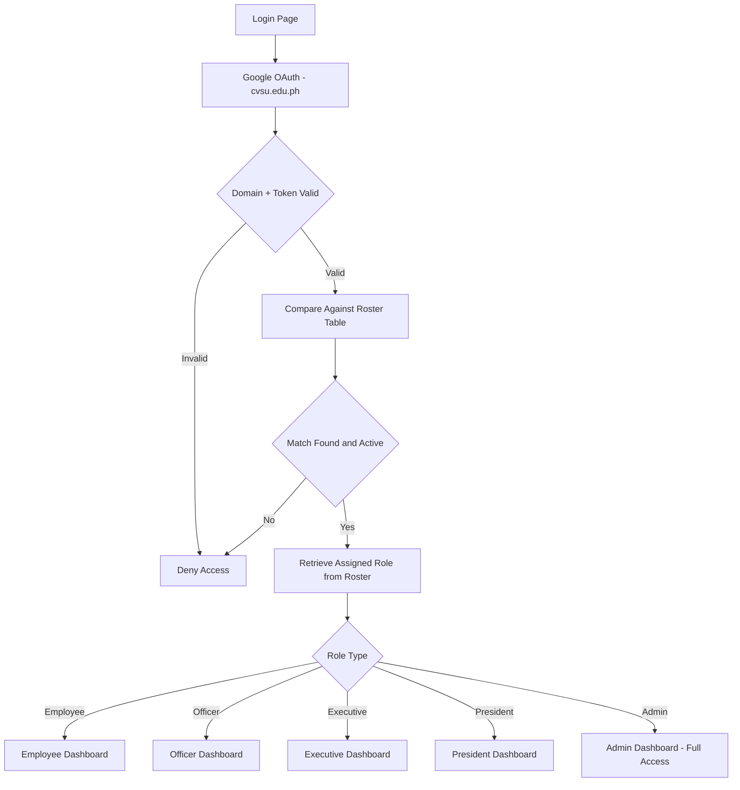
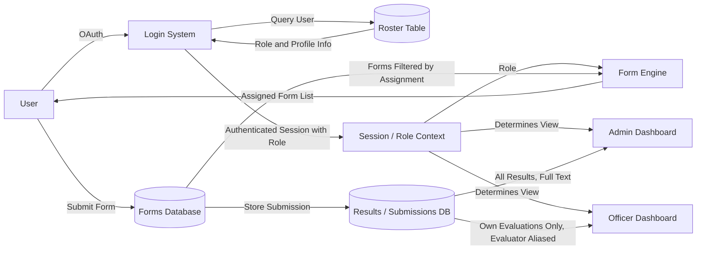
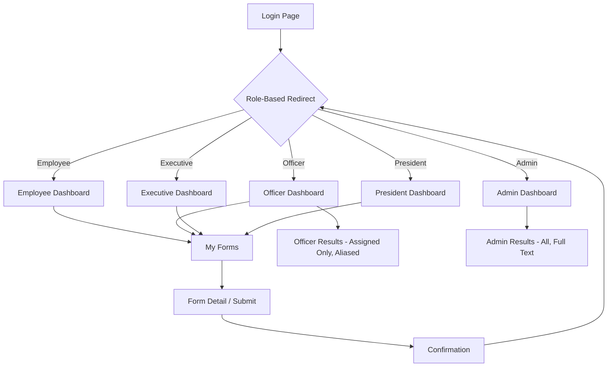
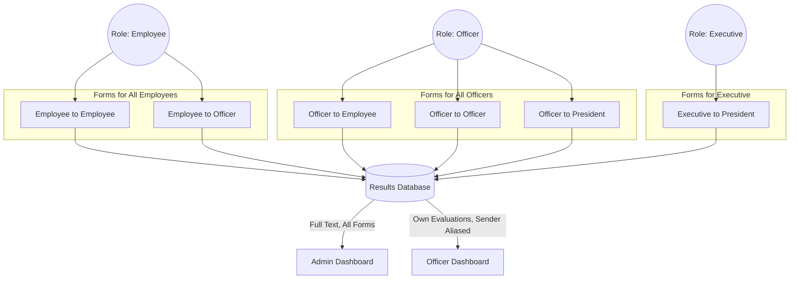

# architecture.md

System context for the **Evaluator** application. This file is the authoritative
description of the stack, data model, and access rules. When code and this file
disagree, treat this file as the intended design and flag the divergence.

---

## 1. Purpose

Evaluator is an internal performance-evaluation web app for a Cavite State
University unit. Signed-in members fill out evaluation forms about other members.
Results are aggregated and exposed through two dashboards with very different
visibility rules:

- **Admin** sees every submission in full, with real identities.
- **Officers** see only evaluations directed at them, with the evaluator's
  identity replaced by a per-cycle alias (`OFFICER01`, `EMP0042`, …).

Anonymity of the evaluator toward the evaluatee is the core product guarantee.
Most of the design below exists to make that guarantee hard to break by accident.

---

## 2. Locked technology decisions

These are settled. Do not substitute alternatives or introduce parallel
libraries that overlap these responsibilities.

| Layer | Technology | Responsibility |
|---|---|---|
| Frontend | Next.js (App Router, React, TypeScript) | Login page, role-based dashboards, forms UI |
| Styling | Tailwind CSS | All styling. No CSS modules, no styled-components, no component kit |
| Auth | Supabase Auth — Google OAuth, restricted to `cvsu.edu.ph` | Identity. No passwords are ever stored or handled |
| Database | Supabase (Postgres) | Roster, forms, submissions, answers, alias mappings |
| Access control | Postgres Row Level Security | Enforces per-role visibility. RLS is the boundary, not the UI |
| Frontend hosting | Vercel (free tier) | Deploys the Next.js app |
| Backend hosting | Supabase (free tier) | Postgres + Auth + Storage |
| Admin management | Supabase Studio | Non-developers edit the roster directly, no code deploy needed |

**Implied constraints from the free tiers.** No always-on background workers, no
cron beyond Supabase scheduled functions, no large file storage. Keep everything
request-scoped or in Postgres. Long-running aggregation should be a materialized
view refreshed on demand, not a worker process.

---

## 3. Roles

Five roles, stored as a Postgres enum. Roles come from the roster table, never
from the client, never from OAuth claims, never from a JWT field the user can
influence.

```sql
create type app_role as enum ('employee', 'officer', 'executive', 'president', 'admin');
```

| Role | Fills out | Sees results |
|---|---|---|
| `employee` | Employee→Employee, Employee→Officer | Nothing |
| `officer` | Officer→Employee, Officer→Officer, Officer→President | Evaluations *about themselves*, evaluator aliased |
| `executive` | Executive→President | Nothing (see open question O-2) |
| `president` | President-level forms | Nothing (see open question O-2) |
| `admin` | Nothing required | Everything, full text, real identities |

Roles are **not hierarchical**. `president` does not inherit `officer`
permissions. Do not write `if (role >= X)` style checks anywhere. Permission is
a lookup, not a comparison.

---

## 4. Authentication flow

> Diagram 1 (`login_role_flowchart`) shows an "Enter Credentials" step. That step
> is **superseded** by Google OAuth. There is no credential form in this app.

1. User hits `/login`, clicks the single "Sign in with CvSU Google Account" button.
2. Supabase Auth initiates Google OAuth with `hd=cvsu.edu.ph` as a hint.
3. On callback, the server verifies the email domain again. The `hd` parameter is
   a UX hint only and must never be the sole check.
4. The email is matched against `roster.email` (case-insensitive, `citext`).
   - No match → session is discarded, user is redirected to `/access-denied`.
     Do not auto-provision a profile for unmatched emails.
   - Match found and `roster.is_active = true` → a row in `profiles` is created or
     refreshed, carrying `role` and `roster_id`.
5. Middleware reads the role from `profiles` and redirects to the role's home route.

**Two independent domain checks are required:** one in the Next.js auth callback,
one in the database (a `check` constraint or trigger on `profiles`). A single
check in application code is not sufficient, since Supabase Studio and direct API
access bypass the Next.js layer.

---

## 5. Data model

```sql
-- ── Identity ────────────────────────────────────────────────────────────────

create table roster (
  id          uuid primary key default gen_random_uuid(),
  email       citext unique not null,
  full_name   text not null,
  role        app_role not null,
  department  text,
  is_active   boolean not null default true,
  created_at  timestamptz not null default now(),
  constraint roster_email_domain check (email like '%@cvsu.edu.ph')
);

-- Source of truth for who may log in. Editable by non-developers in Studio.

create table profiles (
  id         uuid primary key references auth.users(id) on delete cascade,
  roster_id  uuid not null references roster(id) on delete restrict,
  email      citext not null,
  role       app_role not null,
  created_at timestamptz not null default now()
);

-- Mirrors roster for the subset who have actually signed in.
-- role is denormalized here so RLS policies avoid a join on every row check.
-- Keep it in sync with a trigger on roster updates.

-- ── Cycles and aliases ──────────────────────────────────────────────────────

create table evaluation_cycles (
  id         uuid primary key default gen_random_uuid(),
  name       text not null,          -- e.g. "AY 2026-2027 1st Sem"
  opens_at   timestamptz not null,
  closes_at  timestamptz not null,
  is_active  boolean not null default false
);

create table aliases (
  id         uuid primary key default gen_random_uuid(),
  cycle_id   uuid not null references evaluation_cycles(id) on delete cascade,
  user_id    uuid not null references profiles(id) on delete cascade,
  alias_code text not null,          -- 'OFFICER01', 'EMP0042'
  unique (cycle_id, user_id),
  unique (cycle_id, alias_code)
);
```

Aliases are **scoped per cycle**. Regenerating them each cycle prevents an
officer from correlating feedback across cycles and identifying a consistent
critic. Never make `alias_code` a stable column on `roster`.

```sql
-- ── Forms ───────────────────────────────────────────────────────────────────

create table forms (
  id             uuid primary key default gen_random_uuid(),
  code           text unique not null,      -- 'EMP_TO_OFFICER'
  title          text not null,
  description    text,
  evaluator_role app_role not null,         -- who must fill this out
  evaluatee_role app_role not null,         -- who is being evaluated
  results_visible_to_evaluatee boolean not null default false,
  is_active      boolean not null default true
);

create table form_questions (
  id          uuid primary key default gen_random_uuid(),
  form_id     uuid not null references forms(id) on delete cascade,
  order_index int not null,
  prompt      text not null,
  kind        text not null check (kind in ('likert', 'scale', 'text', 'choice')),
  options     jsonb,                        -- for 'choice'
  is_required boolean not null default true,
  unique (form_id, order_index)
);

-- ── Assignments and submissions ─────────────────────────────────────────────

create table form_assignments (
  id           uuid primary key default gen_random_uuid(),
  cycle_id     uuid not null references evaluation_cycles(id) on delete cascade,
  form_id      uuid not null references forms(id) on delete cascade,
  evaluator_id uuid not null references profiles(id) on delete cascade,
  evaluatee_id uuid not null references profiles(id) on delete cascade,
  unique (cycle_id, form_id, evaluator_id, evaluatee_id),
  constraint no_self_evaluation check (evaluator_id <> evaluatee_id)
);

create table submissions (
  id            uuid primary key default gen_random_uuid(),
  assignment_id uuid not null unique references form_assignments(id) on delete cascade,
  submitted_at  timestamptz not null default now(),
  status        text not null default 'submitted'
                check (status in ('draft', 'submitted'))
);

create table answers (
  id            uuid primary key default gen_random_uuid(),
  submission_id uuid not null references submissions(id) on delete cascade,
  question_id   uuid not null references form_questions(id) on delete restrict,
  value_numeric numeric,
  value_text    text,
  unique (submission_id, question_id)
);
```

### Weighted scoring

Employee, Officer, and Executive forms each score their likert options against a
different percentage scale (e.g. `N/O = 0%`, `1 = 10%`, `2 = 30%`, …). Weights
are data, not application constants, so an admin can retune them in Studio
without a deploy.

```sql
create table rating_scales (
  key   text primary key,        -- 'employee_default', 'officer_default'
  label text not null
);

create table rating_scale_options (
  scale_key      text not null references rating_scales(key) on delete cascade,
  option_key     text not null,       -- 'N_O', '1', '2', '3', '4'
  weight_percent numeric not null,
  display_order  int not null,
  primary key (scale_key, option_key)
);

alter table forms
  add column rating_scale_key text references rating_scales(key);
```

A form's `rating_scale_key` determines the weight table used for *every*
likert question on that form — the scale is per form, not per question, since
the requirement is one weight set per form category (Employee / Officer /
Executive), not per item. For a `kind = 'likert'` question, the selected
option's key is stored in `answers.value_text` (no new column needed); the
weight itself is resolved by joining `forms.rating_scale_key` →
`rating_scale_options.weight_percent` on `option_key = answers.value_text`.

A submission's total score is the sum of its resolved weights. Per the
free-tier constraint in §2 (aggregation as a materialized view, not a worker),
expose it as:

```sql
create materialized view submission_scores as
select
  s.id as submission_id,
  sum(rso.weight_percent) as total_sum
from submissions s
join answers a on a.submission_id = s.id
join form_questions fq on fq.id = a.question_id and fq.kind = 'likert'
join form_assignments fa on fa.id = s.assignment_id
join forms f on f.id = fa.form_id
join rating_scale_options rso
  on rso.scale_key = f.rating_scale_key and rso.option_key = a.value_text
group by s.id;
```

Refresh it on demand (e.g. after cycle close, or via a scheduled function),
not on every write — matches the no-background-worker constraint.

The seeded rows in `forms` correspond exactly to diagram 4:
`EMP_TO_EMP`, `EMP_TO_OFFICER`, `OFFICER_TO_EMP`, `OFFICER_TO_OFFICER`,
`OFFICER_TO_PRESIDENT`, `EXEC_TO_PRESIDENT`.

A form appears on a user's "My Forms" page when a `form_assignments` row exists
for them in the active cycle and no `submissions` row is attached yet. Do not
derive the form list from role alone — the assignment table is the source of truth
for *who evaluates whom*.

---

## 6. Access control

RLS is enabled on every table. There are no exceptions and no
`using (true)` policies on tables containing submission data.

### The alias invariant

> An officer's query path must never return `evaluator_id`, the evaluator's
> email, or their name — not in a column, not in a join, not in an error message,
> not in a `count` grouped by evaluator.

RLS filters *rows*, not *columns*. Filtering rows alone is insufficient here,
because an officer legitimately has row access to feedback about themselves —
that row still contains the evaluator's ID. Enforce the invariant in three layers:

1. **Column privileges.** `revoke select (evaluator_id) on form_assignments from authenticated;`
   Admin queries run through a separate path (see below).
2. **A dedicated view.** Officers read exclusively from `officer_results_view`,
   which joins to `aliases` and exposes `alias_code` in place of any identity
   column. Mark it `with (security_barrier)` so the planner cannot leak through
   a cheap user-supplied function in the `where` clause.
3. **A test.** There is a required test asserting that the officer role's result
   payload contains no UUID matching any `profiles.id` other than their own.

```sql
create view officer_results_view with (security_barrier) as
select
  s.id            as submission_id,
  fa.evaluatee_id,
  fa.form_id,
  fa.cycle_id,
  al.alias_code   as evaluator_alias,
  ss.total_sum,
  s.submitted_at
from submissions s
join form_assignments fa on fa.id = s.assignment_id
join aliases al on al.user_id = fa.evaluator_id and al.cycle_id = fa.cycle_id
left join submission_scores ss on ss.submission_id = s.id
where s.status = 'submitted';
```

`officer_results_view` exposes `total_sum` but never the individual
`answers` rows behind it — item-level detail stays admin-only. The Admin
dashboard reads `submissions` joined directly to `answers`, `form_questions`,
and `submission_scores`, giving full text plus the same total.

### Policy sketch

```sql
-- Everyone reads their own profile.
create policy profiles_self on profiles
  for select using (id = auth.uid());

-- Evaluators see only their own assignments.
create policy assignments_own on form_assignments
  for select using (evaluator_id = auth.uid());

-- Evaluators write answers only into their own unsubmitted submission.
create policy answers_own_draft on answers
  for insert with check (
    exists (
      select 1 from submissions s
      join form_assignments fa on fa.id = s.assignment_id
      where s.id = submission_id
        and fa.evaluator_id = auth.uid()
        and s.status = 'draft'
    )
  );

-- Officers read results about themselves, through the view only.
create policy results_about_self on submissions
  for select using (
    exists (
      select 1 from form_assignments fa
      join forms f on f.id = fa.form_id
      where fa.id = submissions.assignment_id
        and fa.evaluatee_id = auth.uid()
        and f.results_visible_to_evaluatee
    )
  );

-- Admin reads everything.
create policy admin_all on submissions
  for select using (
    exists (select 1 from profiles p
            where p.id = auth.uid() and p.role = 'admin')
  );
```

Define `current_role()` as a `security definer` function that reads
`profiles.role` for `auth.uid()`, and use it inside policies rather than
repeating the subquery. Mark it `stable`.

### Service role key

`SUPABASE_SERVICE_ROLE_KEY` bypasses RLS entirely. It may appear only in server
components, route handlers, and server actions. It must never be imported into a
file that carries `'use client'`, never prefixed `NEXT_PUBLIC_`, and never used
merely to make a query easier. If a query needs the service role, that is a
signal the RLS policy is missing.

---

## 7. Routes

```
/login                       Public. Google OAuth button only.
/auth/callback               Route handler. Domain check, roster match, profile upsert.
/access-denied               Public. Shown when email is not in the roster.

/dashboard                   Server component. Reads role, redirects to the below.
/employee                    Employee home
/officer                     Officer home
/executive                   Executive home
/president                   President home
/admin                       Admin home

/forms                       "My Forms" — assignments pending for the active cycle
/forms/[assignmentId]        Form detail and submit
/forms/[assignmentId]/done   Confirmation, links back to role home

/officer/results             Officer results dashboard — aliased, own evaluations only
/admin/results               Admin results dashboard — everything, full identities
/admin/roster                Read-only roster view; edits happen in Supabase Studio
/admin/cycles                Open/close cycles, generate aliases
```

Route protection lives in `middleware.ts` *and* in each route's server component.
Middleware alone is not sufficient — it does not run for every rendering path and
should be treated as a redirect convenience, not a security boundary.

---

## 8. Directory layout

```
app/
  (auth)/login/page.tsx
  auth/callback/route.ts
  (app)/
    layout.tsx                 Session + role provider
    dashboard/page.tsx
    employee/page.tsx
    officer/page.tsx
    officer/results/page.tsx
    executive/page.tsx
    president/page.tsx
    admin/page.tsx
    admin/results/page.tsx
    forms/page.tsx
    forms/[assignmentId]/page.tsx
components/
  ui/                          Primitives (Button, Card, Table)
  forms/                       QuestionRenderer, LikertScale, FormShell
  results/                     ResultsTable, AliasBadge, ScoreSummary
lib/
  supabase/server.ts           Server client (cookies-based)
  supabase/client.ts           Browser client (anon key only)
  supabase/admin.ts            Service-role client. Server-only. Has a runtime guard.
  auth/roles.ts                Role constants, route map, guard helpers
  queries/                     Typed query functions, one file per domain area
types/
  database.ts                  Generated: supabase gen types typescript
supabase/
  migrations/                  Ordered SQL migrations. Schema changes go here only.
  seed.sql                     The six form definitions and their questions
middleware.ts
```

Schema changes are made as migration files and applied, never by editing tables
by hand in Studio. Studio is for roster and cycle data, not for DDL.

---

## 9. Conventions

- TypeScript strict mode. No `any`. Database types are generated, not hand-written.
- Server Components by default. `'use client'` only for genuine interactivity
  (form inputs, filters, modals).
- Mutations are Server Actions. No client-side writes to Supabase.
- All database reads go through `lib/queries/`. Components never construct
  Supabase queries inline — this keeps the RLS surface auditable in one place.
- Naming: `snake_case` in SQL, `camelCase` in TypeScript. Convert at the query
  layer boundary.
- Errors surfaced to users are generic. Never echo a Postgres error message to
  the client; it can reveal table structure and, worse, row contents.

---

## 10. Non-goals

Explicitly out of scope. Do not build these unprompted:

- Email or push notifications
- File upload / attachments on submissions
- A separate admin backend or CMS (Supabase Studio covers it)
- Real-time subscriptions
- Password-based login, magic links, or any non-Google auth
- Self-service account registration
- Mobile apps
- Multi-tenancy or support for institutions beyond `cvsu.edu.ph`

---

## 11. Open questions

Resolve these with the product owner rather than guessing. Where the code must
proceed now, the stated default applies.

- **O-1.** Does "forms assigned to that officer" on the officer results dashboard
  mean evaluations *about* the officer, or evaluations the officer was tasked to
  administer? *Default: about the officer.* This reading is what makes the alias
  requirement coherent.
- **O-2.** Executive and President roles have forms to fill out but no results
  dashboard in any diagram. Do they receive feedback? *Default: no dashboard,*
  `results_visible_to_evaluatee = false` *for president-targeted forms.*
- **O-3.** Minimum submission count before an officer's results become visible.
  With small cohorts, showing a single aliased response can effectively identify
  the author. *Default: withhold until 3 submissions exist for that form and cycle.*
- **O-4.** Is `EMP_TO_EMP` peer feedback that employees should eventually see, or
  admin-only data? *Default: admin-only.*
- **O-5.** Alias regeneration policy when the roster changes mid-cycle.
- **O-6.** `rating_scale_options.weight_percent` is read live at query time, not
  snapshotted per answer. If an admin edits a weight mid-cycle or after a cycle
  closes, every past `total_sum` for that scale recomputes on next materialized
  view refresh — scores are not historically frozen. *Default: live (as
  written above).* If historical scores must stay fixed once a cycle closes,
  add a `weight_percent_at_submission` column to `answers`, populated by a
  trigger on insert, and have `submission_scores` sum that column instead.

---

## Appendix: reference diagrams

Structural styling has been stripped; the relationships are the point.

### A1. Login and role routing



### A2. Data flow



### A3. Page flow



### A4. Form-to-role mapping


